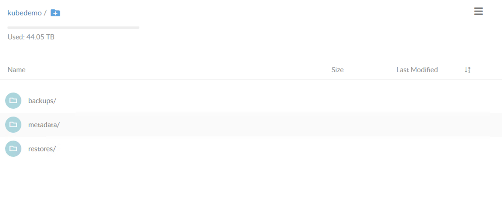

# Velero(Backup/Restore k8s objects),Minio(HA Object Storage for storing unstructered data like videos,photos,images and etc), Restic(encrypt backup data), Etcd(kv persisent store for k8s)

[Velero](https://github.com/vmware-tanzu/velero) (formerly Heptio Ark) gives you tools to back up and restore your Kubernetes cluster resources and persistent volumes. Velero lets you: - Take backups of your cluster and restore in case of loss. - Copy cluster resources to other clusters. - Replicate your production environment for development and testing environments. 

[MinIO](https://github.com/minio/minio) is High Performance Object Storage released under Apache License v2.0. It is API compatible with Amazon S3 cloud storage service. Using MinIO build high performance infrastructure for machine learning, analytics and application data workloads.

[etcd](https://github.com/etcd-io/etcd/blob/master/README.md) is a distributed reliable key-value store for the most critical data of a distributed system, with a focus on being:
* *Simple*: well-defined, user-facing API (gRPC)
* *Secure*: automatic TLS with optional client cert authentication
* *Fast*: benchmarked 10,000 writes/sec
* *Reliable*: properly distributed using Raft

## Install and configure MinIO standalone mode, In prod env you have to setup in distributed mode
```
$ docker pull minio/minio
$ docker run -dit --name minio -p 9000:9000 -v /mnt/backup/k8sbackups/minios:/data minio/minio server /data

Grab access and secret key
$docker exec -it minio cat /data/.minio.sys/config/config.json | egrep "(access|secret)Key"

Change access key and secret key from the Minio dashboard. 
Login browser create new bucket and set it name
```

## Insall and configure Velero with restic option
``` 
$ wget https://github.com/heptio/velero/releases/download/v1.0.0/velero-v1.0.0-linux-amd64.tar.gz
$ tar zxf velero-v1.0.0-linux-amd64.tar.gz
$ sudo mv velero-v1.0.0-linux-amd64/velero /usr/local/bin/
$ rm -rf velero*

Create credentials file (Needed for velero initialization)
$ cat <<EOF>> minio.credentials
[default]
aws_access_key_id=minio
aws_secret_access_key=minio123
EOF

Export kubeconfig because valero look at KUBECONFIG and setup velero namespace, crds

Install Velero in the Kubernetes Cluster
$ velero install \
   --provider aws \
   --bucket kubedemo \
   --secret-file ./minio.credentials \
   --backup-location-config region=minio,s3ForcePathStyle=true,s3Url=http://10.0.80.53:9000 \
   --use-restic
```

## Velero Backup
```
$ velero backup-location get
NAME      PROVIDER   BUCKET/PREFIX
default   aws        kubedemo

$ velero backup get
NAME   STATUS   CREATED   EXPIRES   STORAGE LOCATION   SELECTOR

It is CRDs provided by velero
$ kubectl -n velero get backups 

$  kubectl -n velero get crds
NAME                                CREATED AT
backups.velero.io                   2020-05-13T22:23:37Z
backupstoragelocations.velero.io    2020-05-13T22:23:37Z
deletebackuprequests.velero.io      2020-05-13T22:23:37Z
downloadrequests.velero.io          2020-05-13T22:23:37Z
oneagents.dynatrace.com             2020-04-08T15:07:52Z
podvolumebackups.velero.io          2020-05-13T22:23:37Z
podvolumerestores.velero.io         2020-05-13T22:23:37Z
resticrepositories.velero.io        2020-05-13T22:23:37Z
restores.velero.io                  2020-05-13T22:23:37Z
schedules.velero.io                 2020-05-13T22:23:37Z
serverstatusrequests.velero.io      2020-05-13T22:23:37Z
volumesnapshotlocations.velero.io   2020-05-13T22:23:37Z

It takes entire cluster backup
$ velero backup create firstbackup

Create sample ns and install sample pod
$ kubectl create ns testing
$ kubectl -n testing run nginx --image nginx

It takes backup only testing namespace
$ velero backup create firstbackup --include-namespaces testing

It takes backup all cluster and exclude  testing namespace
$ velero backup create firstbackup —exclude-namespaces testing

It takes backup all cluster and exclude  configmaps
$ velero backup create firstbackup --include-resources  —exclude-resources configmaps

It takes backup only testing namespace and specific resources
$ velero backup create firstbackup --include-namespaces testing --include-resources pods,deployments,services

It takes backup only testing namespace and exclude specific resources
$ velero backup create firstbackup --include-namespaces testing —exclude-resources pods

List backups
$ velero backup get
NAME          STATUS                      CREATED                         EXPIRES   STORAGE LOCATION   SELECTOR
firstbackup   Completed                   2020-05-14 02:50:40 +0400 +04   29d       default            <none>


$ velero backup create firstbackup --include-namespaces testing
Backup request "firstbackup" submitted successfully.
Run `velero backup describe firstbackup` or `velero backup logs firstbackup` for more details.

$  velero backup describe firstbackup
Name:         firstbackup
Namespace:    velero
Labels:       velero.io/storage-location=default
Annotations:  <none>
Phase:  Completed
Namespaces:
  Included:  testing
  Excluded:  <none>
Resources:
  Included:        *
  Excluded:        <none>
  Cluster-scoped:  auto
Label selector:  <none>
Storage Location:  default
Snapshot PVs:  auto
TTL:  720h0m0s
Hooks:  <none>
Backup Format Version:  1

Started:    2020-05-14 02:50:40 +0400 +04
Completed:  2020-05-14 02:50:41 +0400 +04

Expiration:  2020-06-13 02:50:40 +0400 +04
Persistent Volumes: <none included>

$  kubectl -n velero get backups
NAME          AGE
firstbackup   1m
```


## Velero Restore  
```
Delete testing ns
$ kubectl delete ns testing

$ velero restore get
NAME   BACKUP   STATUS   WARNINGS   ERRORS   CREATED   SELECTOR

Restore ns with velero

# velero restore create firstbackup-restore1 --from-backup firstbackup
Restore request "firstbackup-restore1" submitted successfully.
Run `velero restore describe firstbackup-restore1` or `velero restore logs firstbackup-restore1` for more details
[root@haproxypatroni02 ~]# velero restore describe firstbackup-restore1
Name:         firstbackup-restore1
Namespace:    velero
Labels:       <none>
Annotations:  <none>
Phase:  Completed
Backup:  firstbackup
Namespaces:
  Included:  *
  Excluded:  <none>
Resources:
  Included:        *
  Excluded:        nodes, events, events.events.k8s.io, backups.velero.io, restores.velero.io, resticrepositories.velero.io
  Cluster-scoped:  auto
Namespace mappings:  <none>
Label selector:  <none>
Restore PVs:  auto

$ velero restore get
NAME                   BACKUP        STATUS      WARNINGS   ERRORS   CREATED                         SELECTOR
firstbackup-restore1   firstbackup   Completed   0          0        2020-05-14 03:13:44 +0400 +04   <none>

$ kubectl get all -n testing
NAME        READY   STATUS    RESTARTS   AGE
pod/nginx   1/1     Running   0          49s

$ velero restore delete firstbackup-restore1
Are you sure you want to continue (Y/N)? Y
Restore "firstbackup-restore1" deleted
$ velero restore get
NAME   BACKUP   STATUS   WARNINGS   ERRORS   CREATED   SELECTOR


$ velero backup delete firstbackup
Are you sure you want to continue (Y/N)? Y
Request to delete backup "firstbackup" submitted successfully.
The backup will be fully deleted after all associated data (disk snapshots, backup files, restores) are removed.
``` 


## Schedule backups with velero
``` 
$  velero schedule get
NAME   STATUS   CREATED   SCHEDULE   BACKUP TTL   LAST BACKUP   SELECTOR

$ velero schedule create firstschedule --schedule="@every 2h" --include-namespaces testing
Schedule "firstschedule" created successfully.

$  velero schedule get
NAME            STATUS    CREATED                         SCHEDULE    BACKUP TTL   LAST BACKUP   SELECTOR
firstschedule   Enabled   2020-05-14 03:40:22 +0400 +04   @every 2h   720h0m0s     21s           <none>

$  velero backup get
NAME                           STATUS                      CREATED                         EXPIRES   STORAGE LOCATION   SELECTOR
firstschedule-20200513234023   Completed                   2020-05-14 03:40:23 +0400 +04   29d       default            <none>


$  velero schedule delete firstschedule
Are you sure you want to continue 

$  velero schedule delete --all


Change ttl value of backup in that case backup exist in object store till to this time
$ velero backup create firstbackup --include-namespaces testing  —ttl 3h


Migrate apps between k8s clusters, I have some pvc, deploy and svc in prod cluster and want to migrate to preprod. it will tak with k8s api and take all snapshotos(include pv)
$ velero backup create wp --include-namespaces default —wait
wait for backup to complete
$   velero backup describe firstbackup —details
```
## MinIO Web UI 



## Etcd Backup/Restore
For backup you can use etcd-kv-backup.sh script. For restore, Let’s say the Kubernetes cluster went completely down and we need to recover the Kubernetes cluster from the etcd snapshot.Normally, start the etcd cluster and do the kubeadm init on the master node with etcd endpoints.Make sure you put the backup certificates into /etc/kubernetes/pki folder before kubeadm init. It will pick up the same certificates.

## Resources
Etcd:<br />
https://medium.com/velotio-perspectives/the-ultimate-guide-to-disaster-recovery-for-your-kubernetes-clusters-94143fcc8c1e <br />
https://labs.consol.de/kubernetes/2018/05/25/kubeadm-backup.html<br />

Velero:<br />
https://velero.io/docs/master/how-velero-works/ <br />
https://www.objectif-libre.com/en/blog/2020/01/10/kubernetes-backup-stateful-apps/ <br />
https://blog.kubernauts.io/ <br />backup-and-restore-of-kubernetes-applications-using-heptios-velero-with-restic-and-rook-ceph-as-2e8df15b1487<br />

MinIO: <br />
https://docs.min.io/docs/distributed-minio-quickstart-guide.html

